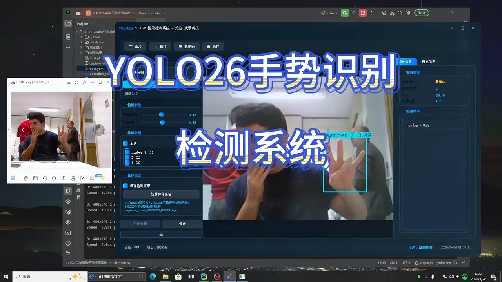
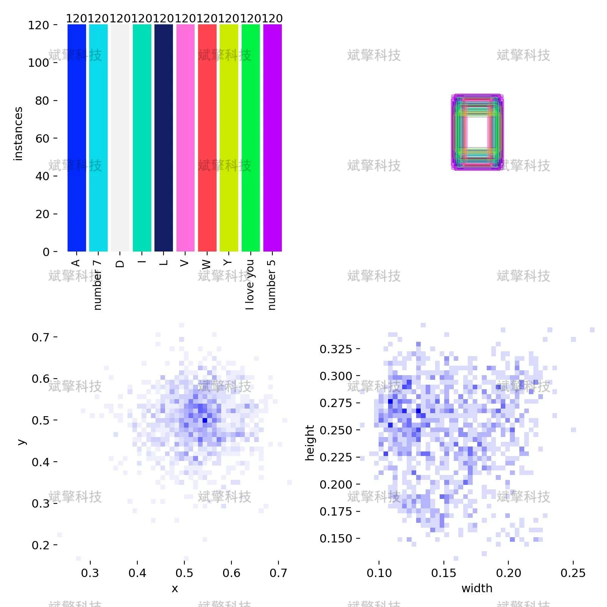
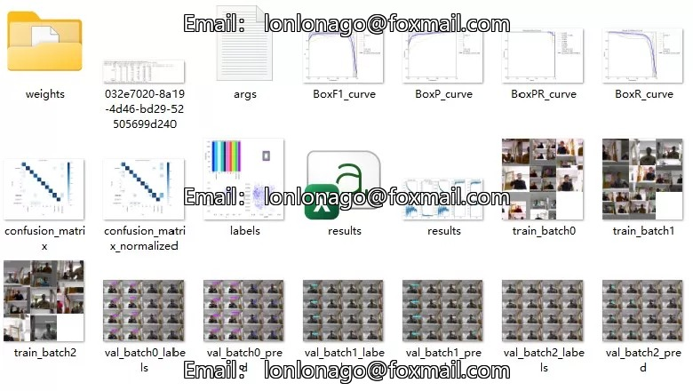
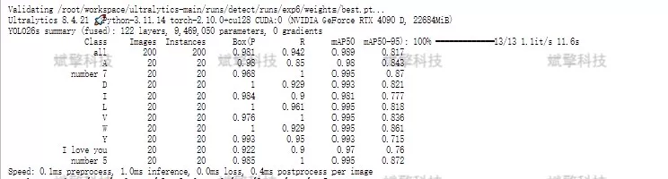
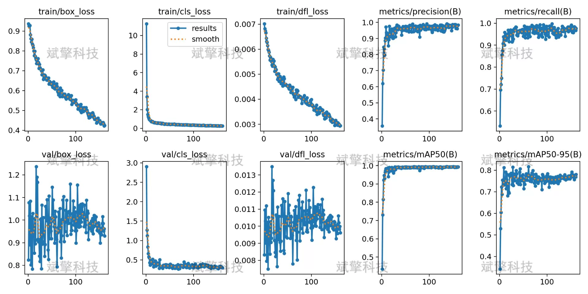
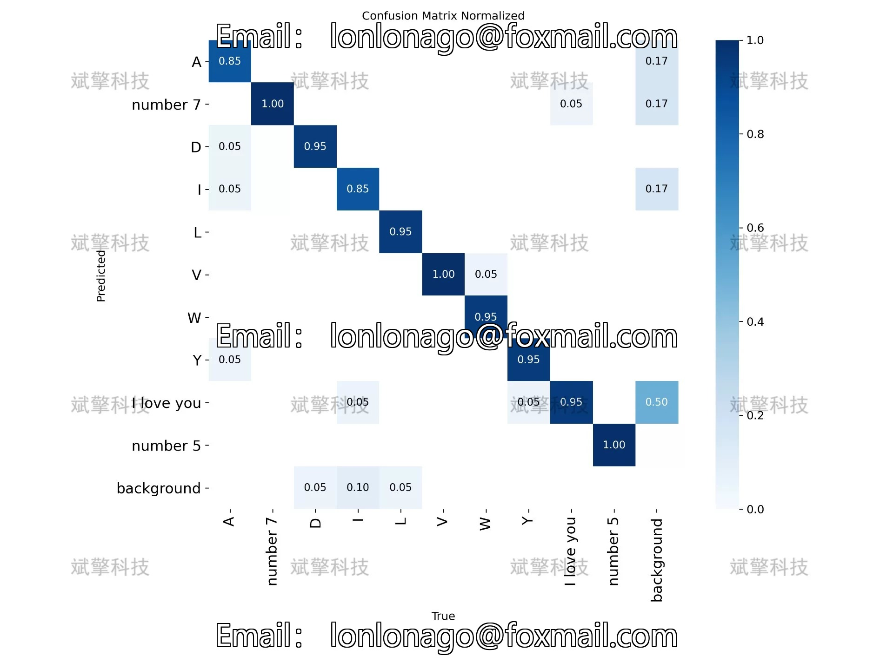
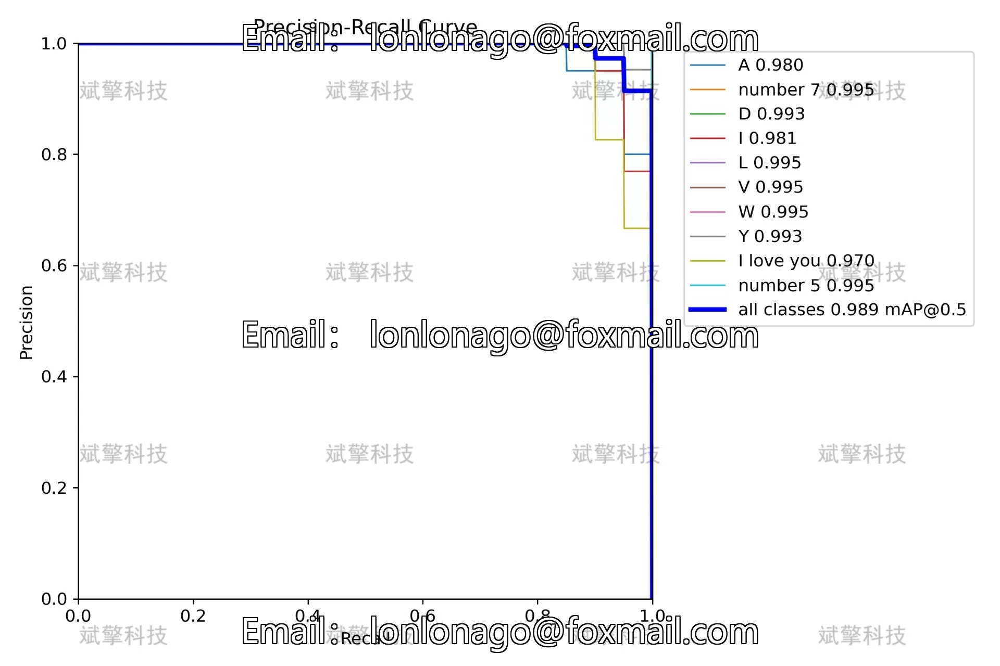
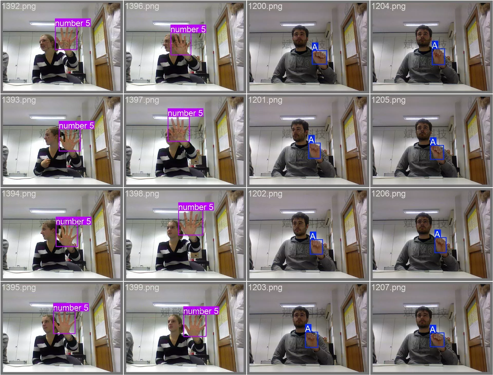
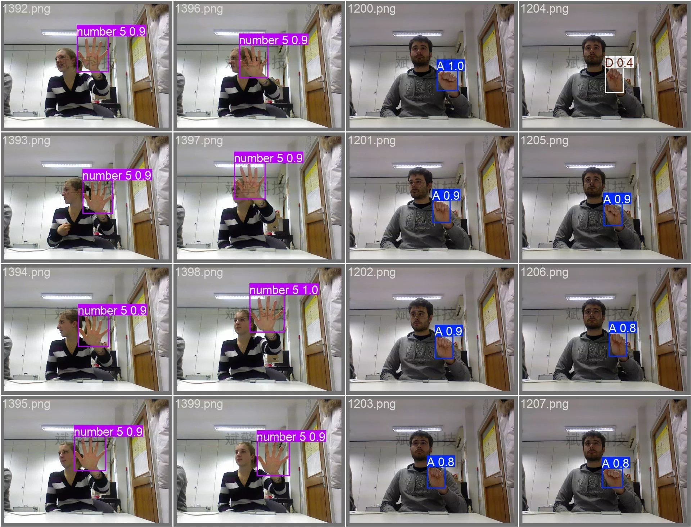

# YOLOv26 Gesture Recognition System | Model + UI Interface

## Body

YOLO26 Gesture Recognition System | Model + UI Interface

This research report is based on the YOLO26 object detection algorithm and has built a real-time recognition detection system for 10 common gestures. The system uses the Ultralytics YOLO26 framework, trained and validated on a dataset containing 1400 labeled images, with 1200 training images and 200 validation images. The experimental results show that the model achieved an mAP50 of 98.9% on the validation set, with inference speeds up to 1.0ms/image (approximately 1000 FPS), demonstrating excellent detection accuracy and real-time performance. Through in-depth analysis of the precision-recall curve, confusion matrix, and various category performance indicators, the effectiveness and reliability of this system in complex gesture recognition tasks are verified. This study provides an efficient technical solution for human-computer interaction and intelligent control applications.

The ten gesture categories can be divided into the following categories based on their morphological features:
Letter gestures (A, D, I, L, V, W, Y)
A gesture: Fist clenched, thumb against index finger side
D gesture: Index finger extended, fist clenched, thumb against middle finger
I gesture: Little finger extended, fist clenched
L gesture: Index and thumb extended in L shape, fist clenched
V gesture: Index and middle finger extended in V shape, fist clenched
W gesture: Index, middle, and ring fingers extended in W shape, fist clenched
Y gesture: Little finger and thumb extended, fist clenched
Number gestures (number 5, number 7)
number 5: All fingers spread apart
number 7: Thumb, index, and middle fingers extended, forming a 7-shape
Special meaning gestures (I love you)
Combines the characteristics of Y and I gestures

The gesture dataset used in this study contains a total of 1400 labeled images, approximately divided into 6:1 training set and validation set:
Training set: 1200 images, used for learning and optimizing model parameters
Validation set: 200 images, used for evaluating model performance and adjusting hyperparameters

Free remote installation appointment. Unsuccessful full refund.
Purchase Enjoy the following resources (auto unlocked in Baidu Cloud):
   - YOLO recognition detection project complete source code
   - YOLO format dataset
   - Training code + UI interface code
   - Trained model + result images
   - Software installation package
   - Add WeChat for remote installation appointment (automatically displayed WeChat ID after purchase) - Unsuccessful, full refund

⚙️ Core function modules
Detection capabilities
    Image detection: upload and check immediately, returning detection boxes + category information
    Video detection: supports video files, precise analysis per frame
    Camera real-time detection: connects USB camera, achieves dynamic monitoring
Interaction and control
    Target selection: freely choose one or more categories for detection
    Parameter real-time adjustment: adjustable confidence threshold & IoU threshold, flexible control of accuracy
    Result saving: image/video/camera detection results saved instantly
System and data
    User login registration: Supports password strength checking + encryption storage
    Log recording: automatically records operation and error information (timestamped)

## Images

## Payment

Here is a pay link on Stripe ( https://buy.stripe.com/3cs8yP7sY87d0vu9AB ). Please contact me lonlonago@foxmail.com after funding $89, and I will send you a complete data files , thank you!

